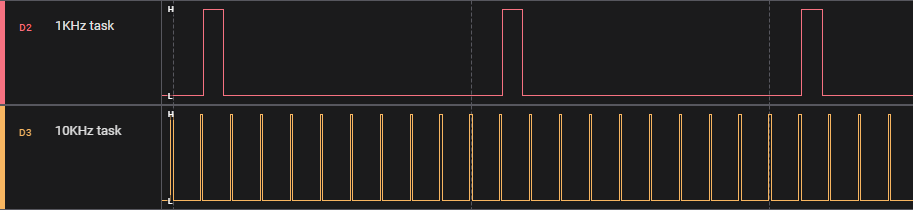
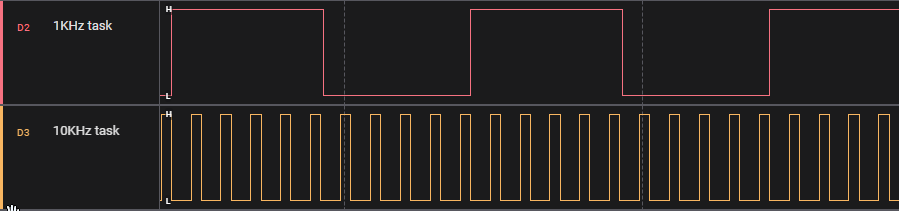
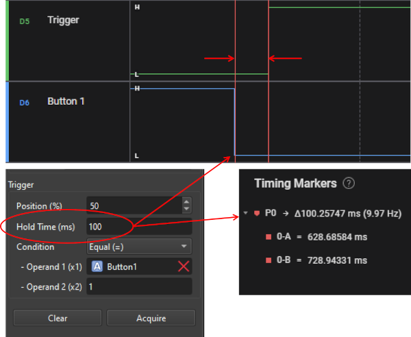
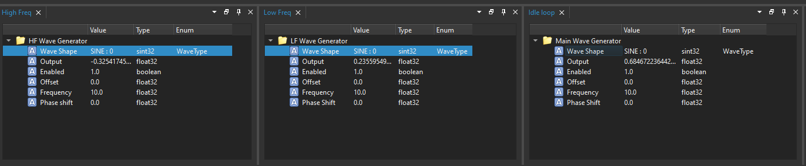
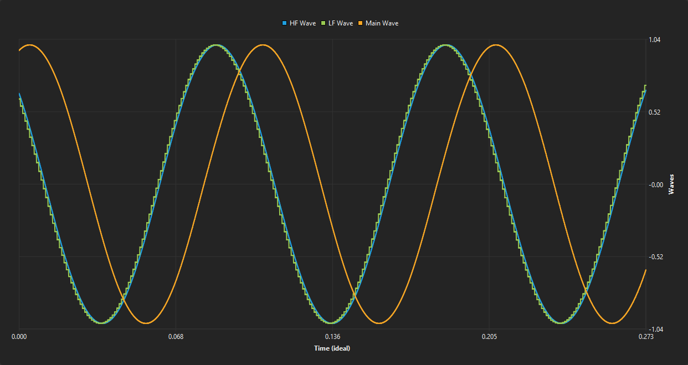
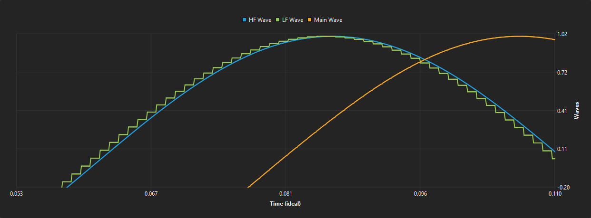

# Aurix TC334 (CMake) Demo

This project is a demonstration of the integration of Scrutiny on a Infineon Aurix TC334 microcontroller. The project uses CMake and builds with ``tricore-elf-gcc`` provided with AURIX Development Studio. This demo runs a minimalistic task scheduler with 3 preemptive tasks 
 
 - 10 Khz High Priority
 - 1Khz Low Priority
 - Idle Loop

 Each of these tasks run a software wave generator that can generate common periodic waves: sine, triangular, square, sawtooth. These wave generators exist to showcase the graphing capabilities of Scrutiny.

 The device communicate through the USB virtual UART at 115200 Bauds/sec (1 stop bit, no parity)

## Required hardware:

 - [kit_a2g_tc334_lite development board](https://www.infineon.com/cms/en/product/evaluation-boards/kit_a2g_tc334_lite/)
 - USB Cable
 - \[Optional\]: Logic Analyzer (for recreating the waveform provided below)

## Required software:

 - GCC for tricore (available with the download of [AURIX Development Studio](https://www.infineon.com/cms/en/product/promopages/aurix-development-studio/))
 - CMake
 - \[Optional\]: GNU Make
 - \[Optional\]: Bash (Git bash for Widnows is fine)

## Building

Assuming the software requirements are all met and the software are in your PATH, calling the following scripts should be enough for building and flashing.

```bash
./scripts/build.sh
./scripts/flash.sh
```

## Prebuilt binary

The prebuilt binary (ready to be flashed) & the Scrutiny Firmware File (.sfd) to be loaded onto the server are located in ``./prebuilt``

## Pin Mapping

 -  P00.0 ( Header X2 - Pin 3) : Low frequency (1KHz) task
 -  P00.2 ( Header X2 - Pin 5) : High frequency (10KHz) task
 -  P00.1 ( Header X2 - Pin 4) : Time reference. 1Hz square wave to validate the correctness of time emasurement.
 -  P00.8 ( Header X2 - Pin 9) : Datalogger (embedded graph) trigger pulse
 -  AscLin0 : UART conencted to the USB port
 -  AscLin1 (Tx: P15.1): Debug UART. retransmit everything received on AscLin0. 


## Task scheduling

The task scheduling is done using the GPT12 module. 

- GPT12.T3 interrupt scehdule the 10KHz loop. (T2 used as reload register)
- GPT12.T6 schedule the 1KHz loop. 

The 10KHz can interrupt the 1KHz and idle loop. The 1KHz task **cannot** interrupt the 10KHz task, but can interrupt the idle loop.



Both timer driven tasks executes a dummy for-loop with a length that can be controlled via scrutiny. 

```c++
    static volatile uint32_t highfreq_load = 1000; // Can be modified by scrutiny
    for (uint32_t i = 0; i < highfreq_load; i++)
        ;
```

The graph below shows what happens when these changes are made : 

 - ``/static/main.cpp/user_task_lowfreq()/lowfreq_load`` : Changed from 10000 to 50000
 - ``/static/main.cpp/user_task_highfreq()/highfreq_load`` : Changed from 1000 to 5000



If a load is increased at the point where a new interrupt is fired before the previous has finished executing, an overrun condition is triggered. In that situation, the task is disabled and LED1 is turned on.

## Scrutiny integration

To keep track of time, this demo uses the STM module (System Timer) configured to run at 20MHz (2 ticks = 100ns).

The scrutiny buffers are purposely sized to match the size of the UART FIFOs. Doing so avoid the complexity handling full FIFOs conditions. Let's remember that the Scrutiny embedded protocol is a command based half-duplex protocol. No new data is sent until the response is fully received.

A single RPV is defined. We showcase that any custom logic can be done in the RPV read/write callback. Writing does not write the same value that is read. Also the value read will change based on the task that reads it (1KHz loop doesn't see the same value as the 10KHz loop).

A datalogging trigger callback toggles a pin when the embedded graph trigger event is fired. This can be useful to synchronize a hardware scope with the software acquisition. 

## Graphs and triggers

In this demo, scrutiny is configured to toggle the pin P00.8 ( Header X2 - Pin 9) when the datalogger trigger is fired.

```c++
    config.set_datalogging_trigger_callback(toggle_graph_trigger_pin);
```

In the following screen capture, we see a trigger fired when Button1 is pressed for 100ms. To achieve this, the suer needs to drag the variable that reads the button state into the trigger condition field of the Embedded Graph configuration window and set a hold time of 100ms.

Note that the button is active low.



## Sampling rates

In this demo, we have 3 tasks:

 - 10 Khz High Priority
 - 1Khz Low Priority
 - Idle Loop

 Each fo these task has an instance of a LoopHandler, enabling the datalogger to sample the memory at the given rate.

 To demonstrate how sampling rates affect datalogging, each of these loops runs a wave generator code where the output of the wave. The parameters of the wave generator are configurable through scrutiny.

 

 In the following graph, we see the 3 sine waves sampled from the 10kHz task. They have been synchronized prior to the acquisitions

  
  

  We can make the following observations

  1. The 1KHz signal has a staircase shape because it is updated at a rate 10x slower than the sampling frequency
  2. The main loop is not in phase because the execution period is not stable since it is not driven by a hardware timer
  3. We can see little artifacts in the main loop signal, essentially little steps when the cpu load increase causing a step in time for the low priority main loop

## Notes

- The update rate and graph download speed are slow. There are delays coming from the Infineon DAS virtual COM port that cause a ~60ms latency between each device response. This does not happen on a real COM port or a FT232 driver.