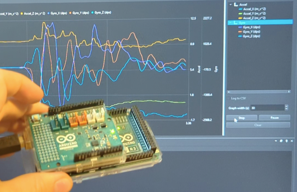

# NorthSec 2024 Demo (Arduino Mega 2560)

This project is a Arduino project used to demonstrate the Scrutiny framework during the 2024 edition of the NorthSec conference (Montreal)


https://nsec.io/session/2024-scrutiny-debugger-debug-test-and-configure-embedded-softwares-through-instrumentation.html

## Required hardware:

 - Arduino Mega 2560
 - 9 Axis Motion Shield (Based on Bosch BNO55)
 - USB cable

  

## Building the Arduino app

Calling the following script should be enough, assuming you have docker configured

```bash
export ARDUINO_PORT=/dev/ttyACM0    # Change serial port
./scripts/build_in_docker
./scripts/flash
```

# Prebuilt binary

The prbuilt binary, ready to be flashed + the Scrutiny Firmware File (.sfd) to be loaded onto the server are located in ``./prebuilt``

## Running the server

```bash
# pip install scrutinydebugger  # For latest release
git clone --depth 1 -b v0.5.2 https://github.com/scrutinydebugger/scrutiny-main /tmp/scrutiny-main && pip3 install -e /tmp/scrutiny-main
scrutiny server --config scrutiny_server_config.json    # Make sure to adjust the serial port name in that configuration
```

## Intercepting the communication

Install interceptty

```bash
git clone https://github.com/nochkin/interceptty
cd interceptty
./configure
make
sudo make install
./test
```

Hook interceptty on the device used as a serial port. ``scripts/setup_debug_port.sh`` will use the same ``ARDUINO_PORT`` variable as the flash scripts and will create a device named tty_debug.  A file named ``tty_debug.log`` will be create by interceptty

```bash
./scripts/setup_debug_port.sh
scrutiny launch-server --config scrutiny_server_config.json # Port must be changed to ./tty_debug
```

## Precisions

 - The server configuration includes a start delay of 1 sec. It is to avoid triggering the arduino bootloader when opening the port. 
The delay can be removed after calling ``stty -hupcl /dev/ttyXXXX``. Doing so avoid triggering the CTS line and resetting the board when the port is open.
 - The Arduino I2C library has been modified to enable reading by interrupt. The BNO55 is too slow to respond for a blocking stream.