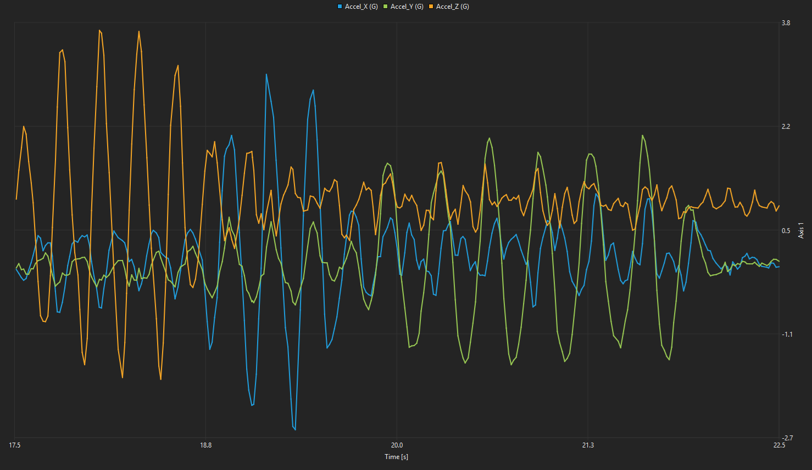

# STM32F4 Demo

This project is a demonstration of the integration of Scrutiny on a STM32F411 Discovery board.
It uses CMake, builds with ARM GCC and comes with all required STM32-specific build dependencies.

The communication is handled through the USB virtual serial port (CDC-ACM).



## Required hardware

- STM32F411 Discovery board
- USB Cable

## Required software

- arm-none-eabi-gcc
- CMake
- GNU Make

## Prebuilt binary

The prebuilt binary (ready to be flashed) and the Scrutiny Firmware File (.sfd) to be loaded onto the server are located in `./prebuilt`

## Building

```
cmake --preset Release
cmake --build build/Release --parallel $(nproc)
```

The final binary to be flashed is `build/Release/stm32_demo_tagged.hex`