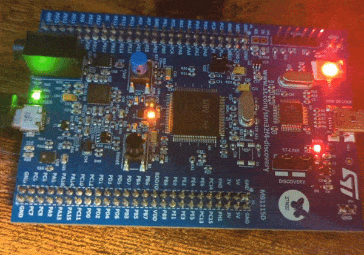

# STM32F4 Demo

This project demonstrates the integration of Scrutiny on an STM32F411 Discovery board in C using the C Wrapper.
It uses CMake, builds with ARM GCC, and includes all required STM32-specific build dependencies.

The application reads the onboard accelerometer and I/Os and exposes the values in global variables. Aliases are added on top of these, making them accessible through Scrutiny with user-friendly paths such as ``/IMU/Accel_X (G)``

Communication is handled via a USB virtual serial port (CDC-ACM) exposed on the user USB connector using the ST libraries. This virtual serial port operates at 1 Mbit/sec regardless of the serial configuration on the host machine. The high speed and low latency of the CDC driver enable the Scrutiny server to poll the device at a relatively high rate.

Connection parameters:
 - **Port** : &lt;port name&gt;
 - **Baudrate** : Any
 - **Stop Bit** : Any
 - **Data Bit** : Any
 - **Parity** : Any

To simplify integration with CMake, all files auto-generated by the CubeMX IDE have been placed in the ``stm32cubemx`` folder and are loaded into a single CMake object library.

## Timings

TIM2 runs at 1 MHz and is used as a time reference for Scrutiny with microsecond precision.  
Although ``HAL_GetTick()`` could be used instead, its millisecond resolution would result in embedded graphs captured in the idle loop having very coarse time precision.

TIM3 generates a 1 kHz interrupt that executes a loop handler, enabling low‑jitter embedded graphs.

The main idle loop runs at approximately 300 Hz because reading the accelerometer is a blocking task that takes about 3.2 ms. 

## SDK demo

A python script ``sdk_demo.py`` showcase how to read/write variables in the device using the Scrutiny SDK.

The demo prints the accelerometer values to the console and makes a rotating pattern with the onboard LED, see the video below.

```bash
# Note:  A server must be running and the scrutiny SDK must be in the Python path
python sdk_demo.py --host localhost --port 8765     
```



## Graph from UI

Below is an example of an acceleration graph acquired with Scrutiny.


## Required hardware

- [STM32F411 Discovery board](https://www.st.com/en/evaluation-tools/32f411ediscovery.html)
- 2x USB Cables  (Power & Communication)

## Required software

- GCC for ARM32
- CMake
- GNU Make (or any other build system supported by CMake)
- \[Optional\]: Bash (Git bash for Windows is fine)

## Prebuilt binary

The prebuilt binary (ready to be flashed) and the Scrutiny Firmware File (.sfd) to be loaded onto the server can be found in the ``./prebuilt`` directory.

## Building

For CMake 3.25+
```bash
cmake --preset Release
cmake --build build/Release --parallel $(nproc)
```
Or use the following bash build script 

```bash
./scripts/build.sh
```

Once built, the binary `build/Release/stm32_demo_tagged.[hex|elf]` can be flashed onto the device using a tool such as [STM32CubeProgrammer](https://www.st.com/en/development-tools/stm32cubeprog.html)

## Note on ``malloc()``

Scrutiny works with static allocation only; no dynamic allocation is performed in the library. In this demo, there is a call to ``malloc()`` during the initialization of Scrutiny. This dynamic allocation is not necessary, it simply simplifies the C integration and the demo code.

Scrutiny was originally written in C++ and later ported to C with a C wrapper. This means the C compiler does not have access to the size of the C++ class at compile time, but the sizes are available through runtime constants (``SCRUTINY_C_<class_name>_SIZE``). Using ``malloc()`` is the easiest way to use these cosntants.

To avoid using ``malloc()`` when initializing Scrutiny in C, two options exists:
 1. Allocate a static buffer with a hard-coded size that is at least as large as the required size. That size can be determined by inspecting the values of the runtime constants once.
 2. Extract the values of the size constants before compilation using ``objdump``.

**N.B.** There are plans to add a CMake helper to automatically generate a header file with the correct values so they can be used at compile time.

## Credit

This demo has been initially written by [MrMati](https://github.com/MrMati) and later modified by the Scrutiny authors.