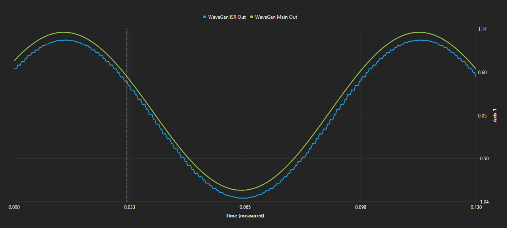
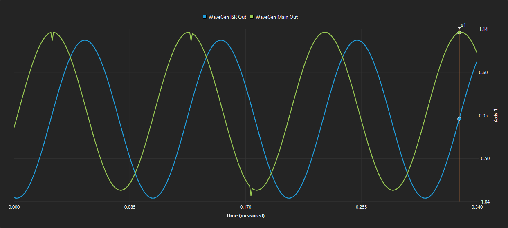
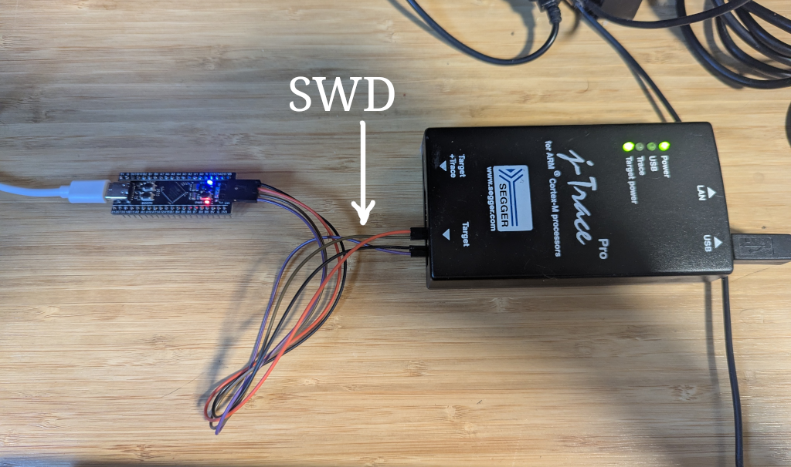
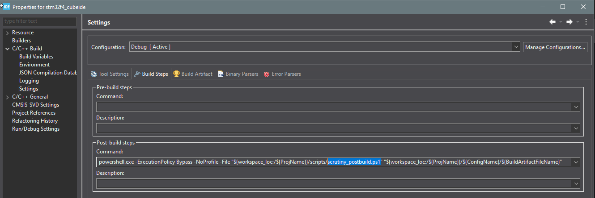

# STM32F4 CubeIDE Demo

This project demonstrates the integration of Scrutiny on a WeAct Black Pill v3.1 board (STM32F411CEU6) in C++ using SEGGER RTT protocol as a communication link.
It builds with STM32CubeIDE and comes with a .ioc file to configure the hardware. The Drivers and main.c files are code generated by STM32CubeMX.

``application.cpp`` contains the top level of the application past the hardware initialization and is untouched by STM32CubeMX.

The application blinks the onboard LED at a variable frequency. It also runs two software wave generators for demonstration purposes.
One wave generator runs in the main loop and the other in a 1KHz Interrupt routine.

Connection parameters:
 - RTT Buffer : 0
 - RTT Device : STM32F411CE

## Timings

TIM2 runs at 1 MHz and is used as a time reference for Scrutiny with microsecond precision.  
Although ``HAL_GetTick()`` could be used instead, its millisecond resolution would result in embedded graphs captured in the idle loop having very coarse time precision.

TIM3 generates a 1 kHz interrupt that executes a loop handler, enabling low‑jitter embedded graphs.
The main idle loop runs as fast as possible. 

## SDK demo

A python script ``sdk_set_led_freq.py`` showcases how to invoke a user defined callback with the "user function" feature.
It can set the frequency of the blinking LED with a value ranging from 0.1Hz to 10Hz. 

The script invokes the ``user_command()``, but could have very well written the frequency variable instead.

```bash 
# Note:  A server must be running and the scrutiny SDK must be in the Python path
python sdk_set_led_freq.py 2 --host localhost --port 8765
```

Where ``--host`` and ``--port`` are the TCP parameters to reach the Scrutiny Server. 

Expected output:
``Requesting a frequency change to 2.0Hz... Success!``

## Graph from UI

With the Scrutiny GUI, we can plot the output of the two wave generator. Using the "Embedded Graph", we can sample the wave variables either from a 1KHz ISR or the main loop.

The graphs below show the 2 wave generators. Both wave generators have a frequency of 10Hz.
The one executed in the main loop has an offset of 0.1.

### Waves sampled with the main loop


### Waves sampled with the 1Khz ISR


### Observations

- The Idle loop is much faster than the 1KHz loop. ~50us per samples (decimated by 10x here)
- We can see the staircase pattern of the 1KHz wave generator when we look at it from the idle loop because 1KHz is the slowest loop
- Conversely, looking from the 1KHz ISR shows two smooth waves, no staircase pattern. (Note that graphs are linearly interpolated in the GUI).
- When looking from the ISR, we see some glitches in the green line. Those happen because the ISR that samples can interrupt the wave generator in the main loop in the middle of its computation.

## Required hardware

- WeAct Black Pill V3.1
- SEGGER J-Link



## Required software

- STM32CubeIDE v2.2+
- STM32CubeMX

## Prebuilt binary

The prebuilt binary (ready to be flashed) and the Scrutiny Firmware File (.sfd) to be loaded onto the server can be found in the ``./prebuilt`` directory.

## Project creation steps

In order to create this project, the following steps were taken:

1. Create a new STM32CubeMX project. Configure the clock tree for a 25MHz crystal.
2. Configure GPIOs and timers
3. Generate the project for STM32CubeIDE.
4. Import the project in STM32CubeIDE then right-click on it and "Convert to C++"
5. Configure Scrutiny
    - Clone the repo as a submodule
    - Add the ``src`` folder to the list of folders to build
    - Add the ``inc`` folder as an include path
    - Copy ``scrutiny_build_config.hpp.default`` to ``scrutiny_build_config.hpp`` and edit the content.
6. Enable debug symbols (-g option) in both Debug AND Release configurations
7. Add ``-gdwarf-4`` as a compile flag everywhere because DWARF V5 (default) support is not very good.
8. Add post-build step to invoke the scrutiny PowerShell scripts (an equivalent .sh is available for linux users)
9. Modify the debug configuration to use the scrutiny tagged binary when flashing.
10. Write the source code and include the RTT lib.



