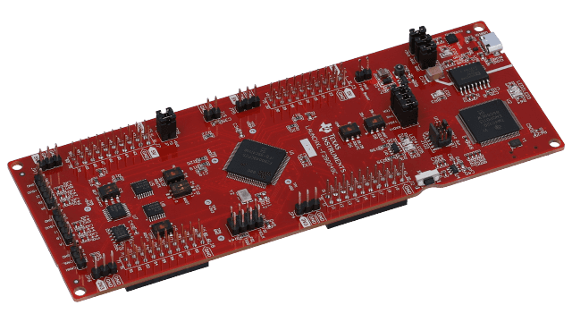
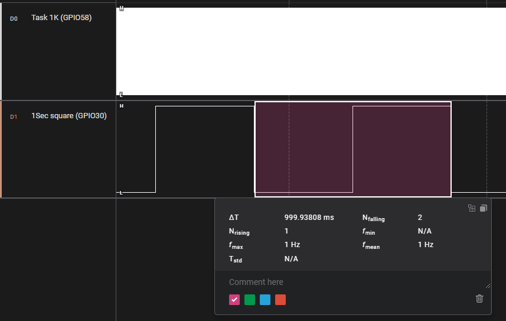
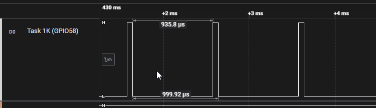
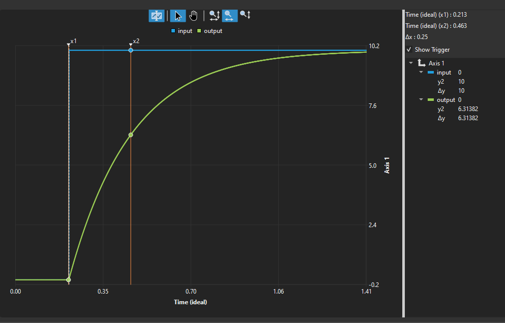
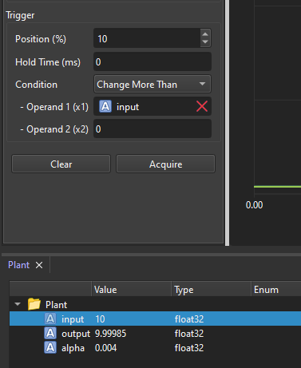
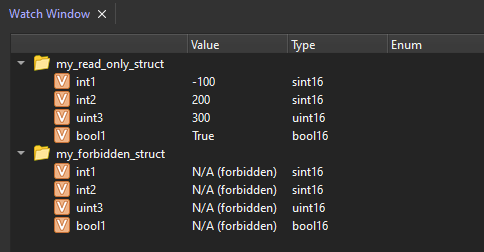
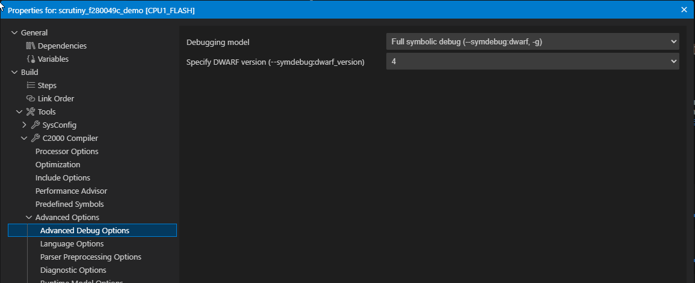
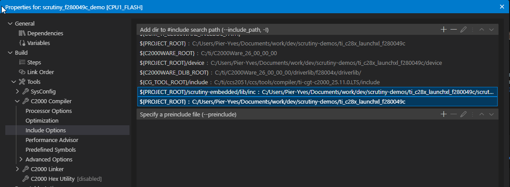
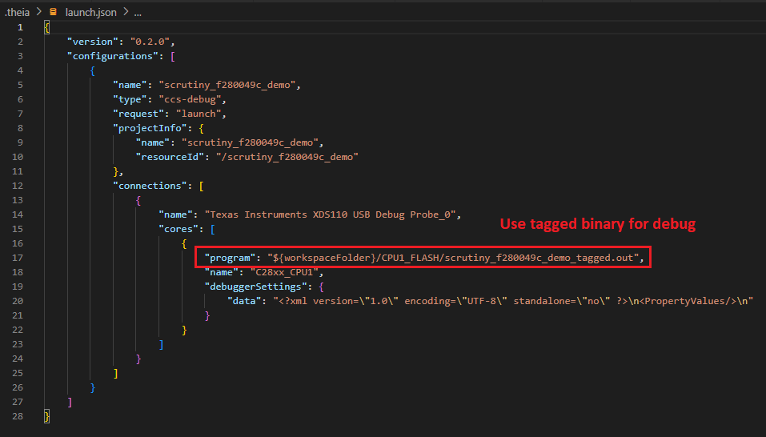
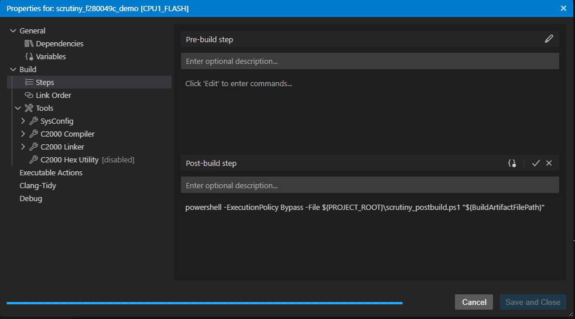

# Texas Instrument LaunchXL-F280049C Demo

This project demonstrates how to integrate Scrutiny on a TI TMS320F280049C (C2000 series) processor. The project is built using Code Composer Studio (Texas Instruments' port of Eclipse/Theia). This demo runs a 1 kHz task in which a dummy first-order system is updated and can be controlled through Scrutiny. It also defines some read-only and forbidden memory regions for demonstration purposes.

The device communicates over serial (SCIA), which is routed through the onboard XDS110 debug probe, providing a USB serial port when connected to a PC. Communication parameters: 115200 baud, 8 bits, no parity, 1 stop bit.

## Required hardware

- [LaunchXL-F280049C](https://www.ti.com/tool/LAUNCHXL-F280049C)
- USB cable
- \[Optional\]: Logic Analyzer (for recreating the waveform provided below)

## Required software

- Code Composer Studio (tested with version 20.5.1)
- PowerShell or Bash to run the post-build script

## Building and running

1. Pull the submodules : ``git submodule update --init``
2. Open CCS and hit Build.
3. Flash either with CCS's built-in Debug/Flash feature, or flash ``CPU1_FLASH/scrutiny_f280049c_demo_tagged.out`` using TI UniFlash.

The CCS project is already configured to build using the CCS "Build" command. After building, a post-build step launches the Scrutiny post-build tools. The project is also configured to flash the .elf file generated by the post-build step when hitting "Debug".

There are 2 post-build scripts: ``scrutiny_postbuild.sh`` for Linux and ``scrutiny_postbuild.ps1`` for Windows. The project is configured for Windows by default.

## Prebuilt binary

The prebuilt binary (ready to be flashed) & the Scrutiny Firmware File (.sfd) to be loaded onto the server are located in ``./prebuilt``

## Pin Mapping

 - GPIO58 ( Header J40 - Pin 34) : 1KHz task
 - GPIO30 ( Header J40 - Pin 33) : 1Hz square wave
 - GPIO23 - Onboard LED4
 - GPIO34 - Onboard LED5

# Project

## Timers
The integration of Scrutiny is done inside ``scrutiny_integration.cpp``.
Two timers are configured in ``main.cpp``: one serves as a time base, incrementing every 100 ns; the other generates an interrupt at 1 kHz.

We validate the accuracy of the time base by toggling a GPIO in the main loop. We also toggle another GPIO when entering/leaving the 1 kHz ISR — this gives an insight into the amount of time spent in the ISR.

<table border=1>
<thead>
    <tr>
        <th>Validation of the time base</th>
        <th>1kHz ISR GPIO</th>
    </tr>
</thead>
<tbody>
    <tr>
        <td> </td>
        <td> </td>
    </tr>
</tbody>
</table>

## Plant
In the 1 kHz ISR, we run a simple first-order system with a time constant of 0.25 s.
The input and output of that system have aliases defined (under ``/Alias/Plant``).
A graph of its response can be plotted using the embedded graph.

A nice way of monitoring the effect of an input change is to add a trigger condition on ``Input`` with condition "Change More Than" 0. With this condition, the graph triggers as soon as the input changes.

## Forbidden and Read-only regions

Inside ``scrutiny-integration.cpp``, 2 structs are defined: ``my_forbidden_struct`` and ``my_read_only_struct``. Scrutiny is then told to protect those regions.
- ``my_read_only_struct`` will be readable, but writing to it will fail and the value will be unchanged.
- ``my_forbidden_struct`` will show no value and will display the following

## LED5 control

To demonstrate how Runtime Published Values (RPVs) can be used, we define one with ID 0x1000 that controls LED5. This makes the LED controllable by Scrutiny even without a .SFD file installed for this firmware. We also define an alias named ``LED5`` that maps to this RPV, giving it a friendly name when a .SFD file is available.

# Steps to recreate this project from scratch

1. Create an empty project for LaunchXL F280049C.
2. Edit `c2000.sysconfig` to enable SCIA on pins 28/29 (UART through the debug probe).
3. Edit the project configuration to select the XDS110 USB debug probe — the default value set by the project wizard is incorrect for this board.
4. Delete all build configurations except `CPU1_FLASH`.
5. Fetch Scrutiny and copy the default config (see ``init_scrutiny.[bat|sh]``).
6. Exclude all folders under `scrutiny-embedded` from the build, except the `lib` folder.
7. Add include paths:
    - `${PROJECT_ROOT}/scrutiny-embedded/lib/inc`
    - `${PROJECT_ROOT}`
8. Configure compiler options: optimization, ELF EABI, debug symbols in DWARF v4.
9. Write the application code and linker script.
10. Add a post-build step.

## Screenshots

- Debug symbols

- Include Paths

- Theia .launch.json

- Post-build step (Windows)

